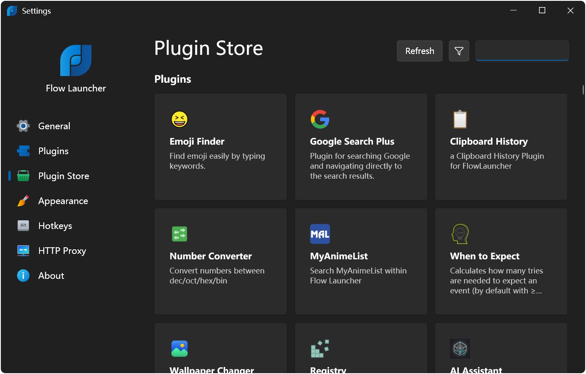

# Welcome to Flow Launcher's plugins repository

This repository contains the information for community-made plugins used in [Flow](https://github.com/Flow-Launcher/Flow.Launcher) and how to make new submissions.

[](https://github.com/Flow-Launcher/Flow.Launcher.PluginsManifest/actions/workflows/updater.yaml)

## Plugin list

Looking for a list of currently available plugins in Flow? Visit [here](https://www.flowlauncher.com/plugins)

## How to submit your plugin

1. Create a file named `${name}-${uuid}.json` in the [plugins](https://github.com/Flow-Launcher/Flow.Launcher.PluginsManifest/tree/main/plugins) directory.
2. Copy these items from your plugin project's `plugin.json` file:
   - `ID`
   - `Name`
   - `Description`
   - `Author`
   - `Version`
   - `Language`
   - `Website`
3. Add `UrlDownload`, `UrlSourceCode`, and `IcoPath` to the file.
4. It should look like this:
   ```json
   {
     "ID": "Unique GUID from your plugin.json, e.g. 2f4e384e-76ce-45c3-aea2-b16f5e5c328f",
     "Name": "Plugin name, e.g. Hello World Python",
     "Description": "Short description, e.g. Python Hello World example plugin",
     "Author": "Author, e.g. Flow Launcher",
     "Version": "Version from your plugin.json, e.g. 1.0.0",
     "Language": "Programming language, e.g. python",
     "Website": "Plugin website, e.g. https://github.com/Flow-Launcher/Flow.Launcher.Plugin.HelloWorldPython",
     "UrlDownload": "URL to download, e.g. https://github.com/Flow-Launcher/Flow.Launcher.Plugin.HelloWorldPython/releases/download/v1.0.0/Flow.Launcher.Plugin.HelloWorldPython.zip",
     "UrlSourceCode": "URL to source code, e.g. https://github.com/Flow-Launcher/Flow.Launcher.Plugin.HelloWorldPython/tree/main", 
     "IcoPath": "Plugin icon image's CDN URL, e.g. https://cdn.jsdelivr.net/gh/Flow-Launcher/Flow.Launcher.Plugin.HelloWorldPython@main/Images/app.png"
   }
   ```
5. Optionally, a plugin can also have the "MinimumAppVersion" property set, restricting it to only appear and be installable on versions of Flow Launcher that meet or exceed the specified version number. For example, setting `"MinimumAppVersion": "2.0.0"` ensures the plugin will not show up or be installable on any Flow Launcher version older than 2.0.0.
6. For `IcoPath`, use a CDN provider for global accessibility. [jsdelivr.com](https://www.jsdelivr.com/) for example as shown above, works well with GitHub repositories.
7. It is a requirement to set up a GitHub Actions workflow for automated build and release. Follow the guide [here](https://www.flowlauncher.com/docs/#/py-setup-project?id=_1-add-github-workflow) and use [this](https://github.com/Flow-Launcher/Flow.Launcher.Plugin.HelloWorldPython/blob/main/.github/workflows/Publish%20Release.yml) as an example.
8. It is a requirement that your plugin conforms with the [Plugin Store policy](#plugin-store-policy).
9. Submit a pull request.
10. The plugin will be available in Flow after the pull request is approved by the Flow Launcher Team.

Flow downloads the manifest (plugins.json) file from various CDN providers, which means the availability of your new plugin depends on when these providers sync their updated files. This syncing process can take several days and sometimes up to a week across all providers. During this period, you may see intermittent updates for your plugin in the manifest, as the provider chosen for retrieval is selected randomly based on the fastest fetch speed.

While the plugin has not yet appeared in the store, you and your users can manually install it using `pm install <url/local path>`.

## Plugin updates

Every three hours the *CI* in this repository will check for new updates from plugins and automatically update them to the latest version.

So you do not need to manually submit a pull request after you make a new release.

## Plugin Store policy

Plugins that facilitate or contain any of the following will not be allowed:
- Malicious code
- Piracy
- Deceptive use
- Inappropriate content
- Illegal activities
- Impersonation
- Abuse
- Fraud
- Spam

## Plugin Store

Users will be able to install your plugin via the store or type `pm install <your-plugin-name>`:
<p align="center"></p>

## Have a plugin enhancement request or issue?

This repository does not track enhancement requests or issues for plugins, it is up to the plugin developers to maintain their own plugin.

If you would like to contribute, submit a request or issue, please visit the plugin's repository via the 'UrlSourceCode' link or from `pm install`, `shift enter`/`right click` on the plugin to go to the context menu and select 'Suggest an enhancement or submit an issue'.
